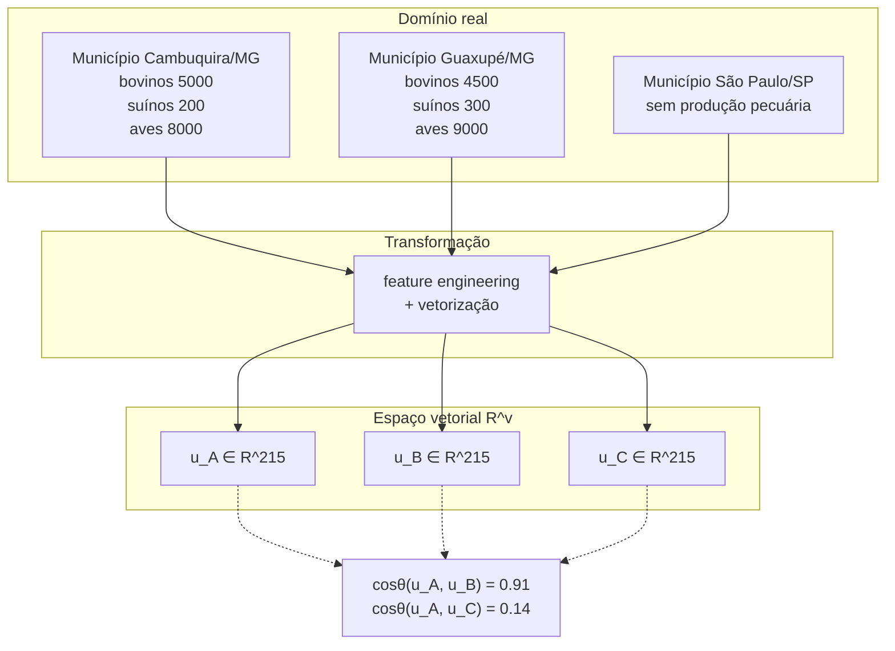

# Sessão 01 — Conceito de Espaço Vetorial

> **Objetivo desta sessão.** Firmar o conceito matemático de espaço vetorial $\mathbb{R}^v$ e mostrar por que representar itens do mundo real como vetores nesse espaço é a jogada fundamental que abre a possibilidade de calcular *similaridade* entre coisas de qualquer natureza — filmes, produtos, pessoas ou, no nosso caso, municípios brasileiros. Sem essa base, o resto do projeto vira feitiçaria; com ela, vira álgebra linear aplicada.

## Por que essa sessão vem antes de tudo

O curso de pós-graduação em Ciência de Dados da DSA dedica um módulo inteiro à *Matemática e Estatística Aplicada Para Data Science, Machine Learning e IA*, e o projeto Cap08 dessa disciplina — que este repositório adapta — pede que o aluno construa um sistema de recomendação de filmes baseado em similaridade cosseno. A escolha desse projeto não é acidental: sistemas de recomendação content-based são talvez a demonstração mais didática possível de *o que álgebra linear pode fazer*. Não usam derivadas, não usam otimização, não usam probabilidades. Usam apenas o fato de que, uma vez que você representa dois itens como vetores no mesmo espaço, existe uma operação bem-definida — o cosseno do ângulo entre eles — que quantifica quão parecidos são.

Esta sessão firma esse conceito. Ao final você deve conseguir olhar para *qualquer* problema de comparação entre coisas e perguntar-se: "como eu represento cada coisa como um vetor no mesmo espaço?" — porque uma vez respondida essa pergunta, o resto do sistema de recomendação é código de dez linhas.

## O que é um espaço vetorial

Formalmente, um espaço vetorial $\mathbb{R}^v$ é o conjunto de todos os vetores com $v$ componentes reais. Um vetor $\mathbf{u} \in \mathbb{R}^v$ é uma tupla ordenada de $v$ números:

$$\mathbf{u} = (u_1, u_2, u_3, \ldots, u_v)$$

Cada componente $u_i$ é uma coordenada em uma das $v$ *dimensões* do espaço. Se $v = 2$, você consegue desenhar o vetor no plano cartesiano — é a seta partindo da origem até o ponto $(u_1, u_2)$. Se $v = 3$, ainda consegue visualizar no espaço tridimensional. Se $v = 215$ — como será o caso do nosso projeto — a intuição visual falha, mas as operações continuam sendo as mesmas. Todas as intuições que você tem do plano funcionam em qualquer $\mathbb{R}^v$: soma, diferença, distância, ângulo, projeção. É essa universalidade que torna o modelo tão poderoso.

## A mudança de paradigma: itens como pontos no espaço

O salto conceitual do projeto é este: **um item do mundo real pode ser representado como um vetor**, e uma vez feito isso, todo o instrumental da álgebra linear passa a ser aplicável.

No projeto DSA original, cada filme é representado por um vetor cujas coordenadas contam quantas vezes cada palavra do vocabulário aparece nos metadados do filme (gêneros, palavras-chave, elenco, sinopse). Se o vocabulário tem 5000 palavras, cada filme vira um vetor em $\mathbb{R}^{5000}$. Um filme de ação com Bruce Willis terá $1$ na coordenada correspondente a "ação" e $1$ na coordenada "bruce_willis", $0$ em quase todas as outras.

No nosso projeto, cada município brasileiro é representado por um vetor cujas coordenadas contam quantas vezes cada *token agropecuário* aparece nas tags do município. Se o vocabulário tem 215 tokens (regiões + UFs + mesorregiões + perfis por atividade + especializações), cada município vira um vetor em $\mathbb{R}^{215}$. Cambuquira/MG terá $1$ na coordenada "sudeste", $1$ na coordenada "mg", $1$ na coordenada "sul_sudoeste_de_minas", $1$ na coordenada "media_bovinocultura", e assim por diante.

## Diagrama: do domínio ao espaço vetorial



A partir do momento em que os três municípios vivem no mesmo espaço $\mathbb{R}^{215}$, podemos perguntar coisas geométricas sobre eles. Qual está mais perto de qual? Qual é o ângulo entre Cambuquira e Guaxupé? Essas perguntas geométricas correspondem, na volta ao domínio, a perguntas semânticas: quais municípios são agropecuariamente parecidos? Quão diferente é São Paulo do resto?

## Operações fundamentais

Três operações do espaço vetorial nos interessam neste projeto.

### Soma de vetores

Dados $\mathbf{u}, \mathbf{v} \in \mathbb{R}^v$, sua soma é o vetor cujas componentes são as somas componente a componente:

$$\mathbf{u} + \mathbf{v} = (u_1 + v_1, u_2 + v_2, \ldots, u_v + v_v)$$

Geometricamente, é o vetor que você obtém colocando $\mathbf{v}$ na ponta de $\mathbf{u}$ (a regra do paralelogramo). No nosso domínio, somar dois vetores de municípios equivale a criar um "perfil médio" das atividades combinadas dos dois — operação que raramente faz sentido diretamente, mas aparece implicitamente em outras.

### Norma euclidiana (comprimento)

A norma euclidiana de um vetor mede seu "comprimento":

$$\|\mathbf{u}\|_2 = \sqrt{u_1^2 + u_2^2 + \ldots + u_v^2}$$

No plano ($v = 2$), é simplesmente o teorema de Pitágoras: a hipotenusa do triângulo formado pelas duas componentes. No nosso projeto, um município com muitas atividades presentes (muitos tokens não-nulos) tem norma maior que um município monótono. Isso é útil — mas também é fonte de confusão que a similaridade cosseno resolve (voltaremos a isso na Sessão 04).

### Produto interno

O produto interno (ou produto escalar) de dois vetores é a soma dos produtos componente a componente:

$$\mathbf{u} \cdot \mathbf{v} = u_1 v_1 + u_2 v_2 + \ldots + u_v v_v$$

Essa é a operação estrela do projeto. Ela mede *o quanto os dois vetores puxam para a mesma direção*. Se dois vetores têm valores altos nas mesmas coordenadas, o produto interno é grande. Se os valores altos estão em coordenadas diferentes, o produto interno é pequeno. Se um vetor tem valor positivo onde o outro tem negativo, o produto interno é negativo (o que, em bag-of-words não-negativa, não acontece).

O cosseno do ângulo entre dois vetores é o produto interno normalizado pelas normas:

$$\cos(\theta) = \frac{\mathbf{u} \cdot \mathbf{v}}{\|\mathbf{u}\|_2 \cdot \|\mathbf{v}\|_2}$$

Toda a magia do recomendador content-based sai daí. Vetores paralelos têm $\cos(\theta) = 1$, ortogonais têm $\cos(\theta) = 0$. Para bag-of-words, onde todas as componentes são $\geq 0$, o cosseno fica em $[0, 1]$ — o valor 1 significando "documentos idênticos", 0 significando "documentos completamente disjuntos".

## O conceito em código

Nas Sessões seguintes você verá como cada peça é implementada. Só como aperitivo, no módulo `rec_agro_br.similarity` a fórmula acima está literalmente escrita:

```python
def cosine_similarity_pair(u, v):
    """Similaridade cosseno entre dois vetores (implementação didática)."""
    u_arr = _to_dense_1d(u)
    v_arr = _to_dense_1d(v)

    produto_interno = float(np.dot(u_arr, v_arr))
    norma_u = float(np.linalg.norm(u_arr))
    norma_v = float(np.linalg.norm(v_arr))

    if norma_u == 0.0 or norma_v == 0.0:
        raise ValueError("Similaridade cosseno indefinida para vetores nulos")

    return produto_interno / (norma_u * norma_v)
```

Não há truque. As três linhas centrais são exatamente a fórmula. A robustez adicional (aceitar arrays esparsos, tratar vetores nulos, converter para densa quando necessário) é engenharia periférica; o conteúdo matemático é o que você acabou de ler.

## Um exemplo concreto do nosso dataset

Vamos pegar dois vetores reais do dataset e calcular o cosseno manualmente. Como o vocabulário tem 215 dimensões e não cabe visualmente aqui, vamos simplificar para um subconjunto de 4 dimensões de exemplo:

|                                  | sudeste | mg | media_bovinocultura | alta_avicultura |
|----------------------------------|--------:|---:|--------------------:|----------------:|
| Cambuquira/MG ($\mathbf{u}$)     | 1       | 1  | 1                   | 1               |
| Guaxupé/MG ($\mathbf{v}$)        | 1       | 1  | 1                   | 1               |
| São Paulo/SP ($\mathbf{w}$)      | 1       | 0  | 0                   | 0               |

O produto interno $\mathbf{u} \cdot \mathbf{v} = 1 \cdot 1 + 1 \cdot 1 + 1 \cdot 1 + 1 \cdot 1 = 4$. Como $\|\mathbf{u}\|_2 = \|\mathbf{v}\|_2 = \sqrt{4} = 2$, temos $\cos(\theta_{uv}) = 4 / (2 \cdot 2) = 1$. Perfeitos: são idênticos neste recorte.

O produto interno $\mathbf{u} \cdot \mathbf{w} = 1 \cdot 1 + 1 \cdot 0 + 1 \cdot 0 + 1 \cdot 0 = 1$. Como $\|\mathbf{w}\|_2 = \sqrt{1} = 1$, temos $\cos(\theta_{uw}) = 1 / (2 \cdot 1) = 0{,}5$. Similaridade média — os dois compartilham a região, mas divergem em tudo mais.

No dataset real com 215 dimensões, quando você fez `python -m rec_agro_br.recommender Cambuquira MG` e obteve Guaxupé/MG com similaridade $0{,}9193$, esse número foi produzido exatamente por essa fórmula, apenas em escala maior. Não há segredo entre a matemática da apostila e o que aparece no seu terminal.

## Recapitulando

Um espaço vetorial $\mathbb{R}^v$ é o palco onde acontece todo o trabalho de similaridade. Representamos cada município como um vetor nesse espaço; a similaridade entre dois municípios vira o cosseno do ângulo entre seus vetores. Essa é a ideia inteira. Todo o resto do projeto — coleta de dados, feature engineering, vetorização, recomendador — é infraestrutura para conseguir chegar até essa comparação com dados reais e bem-formados.

## Próxima sessão

Na Sessão 02 veremos como o mapeamento *domínio → vetor* é feito na prática: como transformar dados brutos do IBGE (rebanhos, mesorregiões, siglas de UF) no campo textual único que servirá de entrada para o vetorizador. Esse processo é chamado de *feature engineering* e é a parte do projeto onde o conhecimento de domínio (o que caracteriza um município agropecuariamente?) importa mais do que o conhecimento matemático.

## Referências para aprofundamento

Strang, G. *Introduction to Linear Algebra*. 6ª edição, Wellesley-Cambridge Press, 2023. Os primeiros três capítulos cobrem exatamente o que discutimos aqui, com dezenas de exemplos geométricos.

Deisenroth, M. P.; Faisal, A. A.; Ong, C. S. *Mathematics for Machine Learning*. Cambridge University Press, 2020. Disponível gratuitamente em [mml-book.github.io](https://mml-book.com). O capítulo 3 (Analytic Geometry) apresenta produto interno, normas e projeções com aplicações a machine learning.

Salton, G.; McGill, M. J. *Introduction to Modern Information Retrieval*. McGraw-Hill, 1983. A referência clássica para o modelo de espaço vetorial em recuperação de informação — a origem da ideia de representar documentos como vetores.
