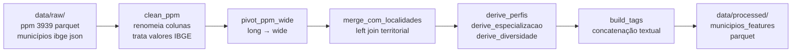

# Sessão 02 — Do Domínio ao Vetor: Municípios como Pontos no $\mathbb{R}^n$

> **Objetivo desta sessão.** Percorrer o caminho conceitual e prático que transforma dados brutos do IBGE em uma representação textual coesa por município — o campo `tags` — que será a entrada do vetorizador na Sessão 03. Este é o momento onde o conhecimento de domínio (o que caracteriza um município agropecuariamente?) importa mais do que qualquer sofisticação matemática.

## Por que essa sessão importa

Na Sessão 01 firmamos o conceito: quando dois itens estão representados como vetores no mesmo espaço, ganhamos toda a máquina da álgebra linear para compará-los. Mas o *como* representar um município como vetor não é dado por nenhuma matemática — é uma decisão de projeto, feita por quem entende o domínio. Escolher bem essa representação é o que separa um recomendador que retorna resultados semanticamente coerentes (como Guaxupé/MG para Cambuquira/MG) de um que retorna aleatoriedade estilizada.

Nossa escolha foi construir para cada município uma *string* — um pequeno documento textual — que sumariza suas características agropecuárias e territoriais mais relevantes. Essa string, chamada `tags` no dataset processado, será tokenizada palavra a palavra e transformada em vetor pelo `CountVectorizer` na próxima sessão. A escolha dos tokens que compõem a tag é o que efetivamente define quais dimensões do espaço $\mathbb{R}^v$ existem e o que cada uma significa.

## O paralelo com o projeto DSA original

O projeto Cap08 da DSA constrói tags de filmes concatenando cinco campos textuais: `overview` (sinopse), `genres` (gêneros), `keywords` (palavras-chave), `cast` (elenco principal) e `crew` (equipe técnica). O código-fonte do projeto original faz literalmente:

```python
df["tags"] = df["overview"] + df["genres"] + df["keywords"] + df["cast"] + df["crew"]
```

Nosso projeto replica *exatamente* essa arquitetura de "campo tags composto de múltiplas fontes", mas troca as fontes por análogas do domínio agropecuário:

| Papel no projeto DSA | Análogo no nosso projeto                       |
|----------------------|------------------------------------------------|
| `overview`           | contexto territorial: região, UF, mesorregião |
| `genres`             | perfis quantitativos por atividade             |
| `keywords`           | lista de atividades presentes                  |
| `cast`               | (agregado em atividades presentes)             |
| `crew`               | especialização produtiva dominante             |

Essa decisão foi deliberada e importante: manter fidelidade estrutural ao projeto original garante que estamos exercitando os mesmos conceitos, apenas em outro domínio. A adaptação está no *o quê* entra em cada categoria, não em *como* a estrutura é montada.

## O pipeline de features em cinco estágios

O módulo `rec_agro_br.features` implementa a construção do campo `tags` em cinco estágios encadeados, cada um uma função pura que recebe DataFrame e devolve DataFrame:



Vamos percorrer cada estágio entendendo qual decisão de domínio ele embute.

### Estágio 1: limpar os dados brutos da PPM

A resposta bruta da API SIDRA vem com nomes de coluna crípticos (`D1C`, `D2N`, `V`, etc.) e valores em formato IBGE que precisam de tradução. O código faz três coisas essenciais:

```python
def clean_ppm(df_ppm_raw):
    df = df_ppm_raw.rename(columns=COLUNAS_SIDRA_RENAME)
    # ... normaliza whitespace ...

    # Trata as convenções do IBGE para valores especiais
    valor_series = df["valor_str"]
    valor_series = valor_series.where(
        ~valor_series.isin(VALORES_ESPECIAIS_IBGE_ZERO), "0"
    )
    valor_series = valor_series.where(
        ~valor_series.isin(VALORES_ESPECIAIS_IBGE_NAN), np.nan
    )
    df["valor"] = pd.to_numeric(valor_series, errors="coerce").astype("Float64")

    # Mapeia nome bruto do rebanho para nome canônico da atividade
    df["atividade"] = df["tipo_rebanho_raw"].map(MAPA_TIPOS_REBANHO)
    return df[["id_municipio", "ano", "atividade", "valor"]]
```

Duas decisões de domínio importantes aqui. Primeira: o IBGE usa `-` (hífen) para significar "dado numérico igual a zero, não resultante de arredondamento", e `...` para "não se aplica". Um ingênuo trataria as duas cadeias como texto e perderia toda a informação numérica. Nós as tratamos como zero e NaN respectivamente, seguindo a norma de convenções do IBGE. Segunda: o mapeamento `MAPA_TIPOS_REBANHO` unifica nomenclatura ("Bovino" → "bovinocultura", "Galináceos - total" → "avicultura") e descarta subcategorias redundantes ("Suíno - matrizes de suínos" é subconjunto de "Suíno - total"), evitando que o vetorizador conte a mesma coisa duas vezes.

### Estágio 2: pivot long → wide

A PPM retorna em formato *long* — uma linha por combinação (município, atividade, valor). Para poder tratar cada atividade como uma coluna numérica, viramos para *wide*:

```python
def pivot_ppm_wide(df_clean):
    wide = df_clean.pivot_table(
        index="id_municipio",
        columns="atividade",
        values="valor",
        aggfunc="sum",
    )
    return wide.fillna(0).astype("Float64").reset_index()
```

A decisão de preencher ausentes com zero (`fillna(0)`) é coerente com o preprocessamento anterior: se o município não aparece na PPM para um rebanho específico, entendemos que ele não produz aquele rebanho (convenção IBGE do hífen). Municípios urbanos sem qualquer produção ganham zero em todas as atividades — comportamento correto, não bug.

### Estágio 3: left join com localidades

Aqui garantimos que *todos os 5571 municípios brasileiros* aparecem no dataset final, mesmo os que a PPM não reporta. Fazemos left join a partir das localidades:

```python
def merge_com_localidades(df_wide, df_localidades):
    df = df_localidades.merge(df_wide, on="id_municipio", how="left")
    atividades = [c for c in df_wide.columns if c != "id_municipio"]
    for atv in atividades:
        df[atv] = df[atv].fillna(0).astype("Float64")
    return df
```

Por que preservar municípios sem produção pecuária? Porque um recomendador que só conhecesse municípios produtores seria útil apenas para consultores agrícolas, não para análise territorial ampla. Um município urbano como São Paulo/SP tem seu lugar no espaço vetorial (com todas as atividades zeradas, especialização `sem_producao_pecuaria`) e vai ser recomendado como similar a outros municípios metropolitanos análogos. Isso é feature, não bug.

### Estágio 4: derivar features categóricas

Aqui está a parte mais rica em decisões de domínio. Três funções derivam colunas categóricas a partir das numéricas.

**`derive_perfis_agropecuarios`** categoriza cada atividade em quatro níveis usando quantis calculados sobre municípios com produção não-nula:

```python
positivos = valores[valores > 0]
q_baixo, q_alto = positivos.quantile(list(quantis))  # tercis: 0.33, 0.66

conditions = [
    valores == 0,
    valores <= q_baixo,
    valores <= q_alto,
]
choices = [f"sem_{atv}", f"baixa_{atv}", f"media_{atv}"]
df[f"perfil_{atv}"] = np.select(conditions, choices, default=f"alta_{atv}")
```

Cambuquira/MG ganha, por exemplo, `perfil_bovinocultura = media_bovinocultura` (está entre o 33º e o 66º percentil nacional dos municípios produtores) e `perfil_avicultura = alta_avicultura` (está acima do 66º percentil). São strings que se tornarão tokens no vetor final.

**`derive_especializacao`** identifica a atividade dominante do município via rank percentil, tomando o cuidado de não considerar valores zero — bug sutil corrigido cedo no projeto e que agora está protegido por teste de regressão:

```python
# Substituir zeros por NaN para que municípios sem produção
# em uma atividade não sejam considerados "especialistas" nela
for atv in presentes:
    valores = df[atv].astype("float64").replace(0, np.nan)
    percentis[atv] = valores.rank(pct=True, method="max")

atividade_dominante = percentis.loc[tem_producao].idxmax(axis=1)
```

**`derive_diversidade`** gera uma string com os nomes das atividades cujo efetivo é positivo, que fará o papel de `keywords` do projeto DSA original:

```python
def presentes(row):
    return " ".join([a for a in atividades if row.get(a, 0) > 0])
df["atividades_presentes"] = df.apply(presentes, axis=1)
```

### Estágio 5: montar as tags

O estágio final concatena tudo em uma única string, aplicando snake_case aos tokens compostos para que o vetorizador os trate como uma unidade:

```python
def build_tags(df):
    partes = []
    # overview: contexto territorial em snake_case
    for col in COLUNAS_CONTEXTO_TERRITORIAL:
        partes.append(df[col].map(_to_snake))
    # genres: perfis quantitativos
    for col in sorted(c for c in df.columns if c.startswith("perfil_")):
        partes.append(df[col].astype(str))
    # crew: especialização
    partes.append(df["especializacao"].astype(str))
    # cast/keywords: atividades presentes
    partes.append(df["atividades_presentes"].astype(str))

    tags = partes[0].astype(str)
    for parte in partes[1:]:
        tags = tags.str.cat(parte.astype(str), sep=" ")
    df["tags"] = tags.str.replace(r"\s+", " ", regex=True).str.strip()
    return df
```

O snake_case é crítico. "Rio Grande do Sul" fragmentado em quatro palavras vira quatro dimensões distintas no espaço vetorial — perderíamos a coesão semântica do nome próprio. Já `rio_grande_do_sul` (uma única palavra do ponto de vista do tokenizer) vira uma única dimensão que aparece exatamente nos municípios daquele estado.

## Uma tag real do dataset

Para consolidar tudo com um exemplo concreto, aqui está a tag real de Cambuquira/MG produzida pelo pipeline:

```
sudeste mg sul_sudoeste_de_minas
sem_avicultura alta_bovinocultura alta_bubalinocultura
alta_caprinocultura sem_coturnicultura media_equinocultura
alta_ovinocultura media_suinocultura
especializado_em_avicultura
bovinocultura bubalinocultura equinocultura suinocultura
caprinocultura ovinocultura avicultura
```

Leia essa string e você reconstitui o município: no Sudeste, em Minas Gerais, na mesorregião Sul/Sudoeste de Minas. Alta em bovinos, bubalinos, caprinos e ovinos, média em equinos e suínos, sem coturnicultura (codornas), especializado em avicultura. Sete atividades ativas.

Duas tags como essa, colocadas lado a lado, permitem ao vetorizador contar os tokens em comum. Municípios com muitos tokens compartilhados terão vetores próximos no $\mathbb{R}^{215}$; municípios com poucos tokens compartilhados, distantes. É assim que a similaridade emergente é possível.

## Recapitulando

A representação vetorial de um item não cai do céu — é uma decisão de projeto que sintetiza *o que sobre o item importa comparar*. Nosso pipeline de cinco estágios pega dados numéricos crus da PPM, os enriquece com contexto territorial, deriva features categóricas por quantis, e concatena tudo em uma string textual que é o que o vetorizador vai efetivamente ver. Preservamos fielmente a arquitetura do projeto DSA original — cinco fontes concatenadas — mas substituímos o conteúdo pelas análogas do domínio agropecuário brasileiro.

## Próxima sessão

Na Sessão 03 veremos como essa string textual `tags` é transformada em vetor esparso pelo `CountVectorizer` do scikit-learn, e como o RSLPStemmer é aplicado seletivamente aos tokens simples para tratamento correto do português brasileiro.

## Referências

Kuhn, M.; Johnson, K. *Feature Engineering and Selection: A Practical Approach for Predictive Models*. CRC Press, 2019. Disponível em [bookdown.org/max/FES](https://bookdown.org/max/FES). Capítulo 5 aborda features derivadas por thresholds e quantis.

IBGE. *Notas Técnicas — Convenções em tabelas*. Documento oficial do IBGE que define os símbolos usados nas tabelas SIDRA (traço, ponto-ponto-ponto, X). Referência para entender o significado dos valores especiais tratados em `clean_ppm`.

Wickham, H. *Tidy Data*. Journal of Statistical Software, 59(10), 2014. Formaliza os conceitos long vs wide que discutimos no Estágio 2 do pipeline.
