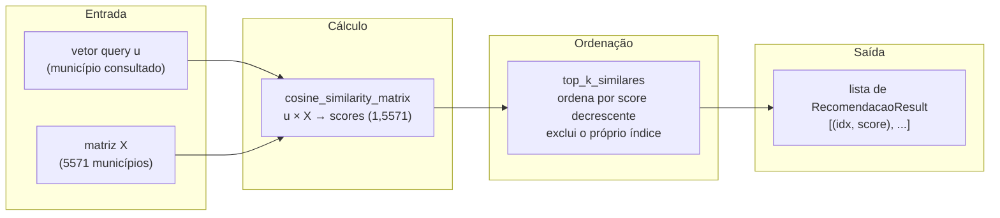

# Sessão 04 — Distâncias e Similaridade: Cosseno, Euclidiana, Manhattan

> **Objetivo desta sessão.** Cobrir as três métricas fundamentais de comparação vetorial que o módulo Cap08 da pós-DSA exercita — similaridade cosseno, distância euclidiana e distância Manhattan. Firmar a matemática de cada uma, entender por que a cosseno é preferida para bag-of-words, e ver como as três estão implementadas no módulo `rec_agro_br.similarity` em duas versões complementares: manual didática em NumPy puro e vetorizada via scikit-learn.

## Onde estamos no pipeline

Chegamos ao ponto crucial. Nas sessões anteriores construímos as tags (Sessão 02) e as transformamos em vetores esparsos $\mathbf{u}_i \in \mathbb{R}^{215}$ (Sessão 03). Temos agora uma matriz $X \in \mathbb{R}^{5571 \times 215}$ onde cada linha é um município do Brasil representado no mesmo espaço vetorial.

A pergunta que o recomendador precisa responder é geométrica: *dado um município específico $i$, quais linhas de $X$ estão mais próximas da linha $i$?* Essa proximidade pode ser medida de várias formas. Cada forma corresponde a uma métrica de distância ou similaridade, e cada uma tem interpretação matemática distinta e adequação prática distinta. As três canônicas — cosseno, euclidiana e Manhattan — são exatamente as que o módulo Cap08 da DSA cobre. Vamos entender por quê.

## Similaridade cosseno: a métrica preferida

A similaridade cosseno entre dois vetores $\mathbf{u}, \mathbf{v} \in \mathbb{R}^v$ é definida como:

$$\cos(\theta) = \frac{\mathbf{u} \cdot \mathbf{v}}{\|\mathbf{u}\|_2 \cdot \|\mathbf{v}\|_2}$$

O numerador é o produto interno (soma dos produtos componente a componente). O denominador é o produto das normas euclidianas dos dois vetores. Geometricamente, esse quociente é exatamente o cosseno do ângulo formado pelos dois vetores quando desenhados a partir da origem.

### Por que é adequada para bag-of-words

Considere dois documentos de tamanhos muito diferentes: um texto curto sobre agricultura e um tratado de 500 páginas também sobre agricultura. Se você usar frequência bruta de palavras, o segundo terá números muito maiores em cada dimensão — não porque fala de temas diferentes, mas porque simplesmente é maior. A norma do segundo vetor será muito superior à do primeiro, e uma métrica sensível a magnitude (como a euclidiana bruta) classificaria os dois como muito distantes, apesar da proximidade semântica.

A cosseno, por normalizar pelas normas, **ignora completamente a magnitude e mede apenas a direção**. Os dois documentos sobre agricultura teriam vetores apontando aproximadamente na mesma direção do espaço, com cosseno próximo de 1, independentemente de um ter 50 palavras e outro 50 mil.

No nosso projeto, isso importa porque municípios têm quantidades diferentes de atividades presentes. Cambuquira tem 7 atividades ativas (7 tokens de atividade não-nulos), Uberaba tem 8, um município urbano tem 0. A cosseno permite comparar o *padrão* de tokens de forma independente da quantidade total.

### O domínio de valores

Como no bag-of-words todos os vetores têm componentes $\geq 0$, o ângulo entre dois vetores fica entre $0°$ (paralelos, mesmas tags) e $90°$ (ortogonais, sem tags em comum). Portanto $\cos(\theta) \in [0, 1]$. Nunca temos similaridade negativa em BoW — o que remove uma fonte de ambiguidade que existe em vetores gerais.

- Cosseno $= 1$: vetores paralelos. Documentos com exatamente as mesmas tags (independente das contagens, pela normalização).
- Cosseno $\approx 0{,}9$: muito similares. Compartilham quase todos os tokens.
- Cosseno $\approx 0{,}5$: parcialmente similares. Compartilham talvez metade dos tokens.
- Cosseno $= 0$: ortogonais. Nenhum token em comum. Documentos falando de assuntos disjuntos.

## Implementação manual, didática

O código do `similarity.py` traz a implementação manual da cosseno para ser lida no notebook (Sessão 05 do pipeline usa isso). A intenção não é performance — sklearn é ordens de magnitude mais rápido em lote — é exercitar a fórmula:

```python
def cosine_similarity_pair(u, v):
    """Similaridade cosseno entre dois vetores (implementação didática)."""
    u_arr = _to_dense_1d(u)
    v_arr = _to_dense_1d(v)
    if u_arr.shape != v_arr.shape:
        raise ValueError(f"Shapes incompatíveis: {u_arr.shape} vs {v_arr.shape}")

    produto_interno = float(np.dot(u_arr, v_arr))
    norma_u = float(np.linalg.norm(u_arr))
    norma_v = float(np.linalg.norm(v_arr))

    if norma_u == 0.0 or norma_v == 0.0:
        raise ValueError("Similaridade cosseno indefinida para vetores nulos")

    return produto_interno / (norma_u * norma_v)
```

Três linhas de cálculo. `np.dot` faz o produto interno; `np.linalg.norm` faz a norma euclidiana; a divisão é a fórmula. O restante é validação de robustez (aceitar arrays esparsos via `_to_dense_1d`, tratar vetores nulos, checar shapes).

## Implementação vetorizada: sklearn.metrics.pairwise

Para operações em lote — por exemplo, calcular a similaridade entre um município e todos os 5571 outros — não vale a pena iterar chamando `cosine_similarity_pair` milhares de vezes. O `sklearn.metrics.pairwise.cosine_similarity` faz isso em uma operação de álgebra linear otimizada:

```python
from sklearn.metrics.pairwise import cosine_similarity
# X: matriz esparsa (n, v). Y: opcional. Se None, calcula X × X.
S = cosine_similarity(X)         # todos-contra-todos: (n, n)
S_query = cosine_similarity(X_query, X)  # 1 × 5571 se X_query tem 1 linha
```

Nosso módulo delega essa operação:

```python
def cosine_similarity_matrix(X, Y=None):
    return _sk_cosine(X, Y)
```

Para nossa matriz $5571 \times 215$, todos-contra-todos ($5571 \times 5571$) roda em milissegundos. Já uma consulta única de um município contra todos ($1 \times 5571$) roda em microssegundos.

Um detalhe operacional importante: a matriz $5571 \times 5571$ densa ocupa $\approx 124$ MB em `float32`. Isso ainda cabe em memória confortavelmente, mas para corpora maiores ($10^6$ documentos) seria proibitivo. Estratégias para escalar incluem: calcular só sob demanda (linha por linha), usar aproximações (LSH, Annoy), ou índices vetoriais (Faiss). Nosso caso é modesto o suficiente para não precisar de nada disso.

## Distância euclidiana

A distância euclidiana entre dois vetores é a generalização do teorema de Pitágoras a $v$ dimensões:

$$d_E(\mathbf{u}, \mathbf{v}) = \sqrt{\sum_{i=1}^{v} (u_i - v_i)^2} = \|\mathbf{u} - \mathbf{v}\|_2$$

Interpreta-se como o comprimento do segmento de reta que liga os dois pontos no espaço. Diferentemente da cosseno, essa métrica é sensível à magnitude — dois vetores paralelos mas de tamanhos muito diferentes têm distância euclidiana grande.

O código:

```python
def euclidean_distance_pair(u, v):
    u_arr = _to_dense_1d(u)
    v_arr = _to_dense_1d(v)
    diff = u_arr - v_arr
    return float(np.sqrt(np.sum(diff * diff)))
```

E a versão vetorizada delegando ao sklearn:

```python
def euclidean_distance_matrix(X, Y=None):
    return _sk_euclidean(X, Y)
```

### Onde a euclidiana é a métrica certa

A euclidiana é a métrica certa quando a magnitude importa semanticamente. Em regressão espacial, análise de clusters em coordenadas geográficas, ou espaços de features onde cada dimensão está bem escalada (por exemplo, features padronizadas com média zero e desvio padrão um), a euclidiana é o padrão. É também a única das três que participa de resultados clássicos como o teorema de Pitágoras generalizado, o método dos mínimos quadrados, e a decomposição em valores singulares.

Para bag-of-words *não normalizada*, é uma escolha ruim porque documentos longos ficam distantes de documentos curtos mesmo se falarem do mesmo tema. Para bag-of-words *normalizada* (cada vetor dividido pela sua norma), a euclidiana passa a ser matematicamente relacionada à cosseno: $d_E(\hat{\mathbf{u}}, \hat{\mathbf{v}})^2 = 2 - 2\cos(\theta)$. Nesse caso, ordenar por euclidiana crescente é equivalente a ordenar por cosseno decrescente.

O exercício 5 do projeto DSA original pede o cálculo manual da euclidiana em $N$ dimensões. Nossa implementação em `euclidean_distance_pair` preserva exatamente esse cálculo, na intenção pedagógica de exercitar a matemática que a matéria pede.

## Distância Manhattan (L1)

A distância Manhattan é a soma das diferenças absolutas componente a componente:

$$d_M(\mathbf{u}, \mathbf{v}) = \sum_{i=1}^{v} |u_i - v_i| = \|\mathbf{u} - \mathbf{v}\|_1$$

O nome vem da geometria dos táxis em Manhattan: para ir do ponto A ao ponto B em uma cidade quadriculada, você percorre a distância horizontal mais a distância vertical, sem cortar caminhos diagonais. É a métrica "grid" no lugar da métrica "reta".

Implementação:

```python
def manhattan_distance_pair(u, v):
    u_arr = _to_dense_1d(u)
    v_arr = _to_dense_1d(v)
    return float(np.sum(np.abs(u_arr - v_arr)))
```

### Onde a Manhattan é útil

Para vetores esparsos, a distância Manhattan tem uma interpretação especialmente clara: é o *número de tokens em desacordo* entre dois documentos (ponderado pelas contagens). Se dois documentos são idênticos em bag-of-words, distância Manhattan zero. Se um tem os tokens A e B e outro tem os tokens C e D, distância 4 (dois tokens presentes de um lado que faltam do outro, e vice-versa).

Ela é também mais robusta a outliers dimensionais que a euclidiana, porque não eleva as diferenças ao quadrado. Se em uma dimensão específica os valores dos dois vetores discordam violentamente, a euclidiana amplifica isso quadraticamente enquanto a Manhattan é linear.

Para o nosso projeto, a Manhattan aparece principalmente na função `explain`, que soma as três métricas ao decompor uma recomendação — dando ao leitor três perspectivas simultâneas sobre a mesma comparação.

## As três lado a lado

Uma comparação numérica ajuda a fixar as diferenças. Suponha três vetores:

$$\mathbf{u} = (1, 1, 0, 0), \quad \mathbf{v} = (2, 2, 0, 0), \quad \mathbf{w} = (0, 0, 1, 1)$$

- $\cos(\mathbf{u}, \mathbf{v}) = 4 / (\sqrt{2} \cdot \sqrt{8}) = 4/4 = 1{,}0$ (paralelos)
- $d_E(\mathbf{u}, \mathbf{v}) = \sqrt{1 + 1 + 0 + 0} = \sqrt{2} \approx 1{,}41$
- $d_M(\mathbf{u}, \mathbf{v}) = 1 + 1 + 0 + 0 = 2{,}0$

Cosseno diz "idênticos em direção"; euclidiana diz "distam $\sqrt{2}$"; Manhattan diz "diferem por 2 unidades no total". Todas as três estão corretas — captam facetas diferentes.

Para $\mathbf{u}$ vs $\mathbf{w}$:

- $\cos(\mathbf{u}, \mathbf{w}) = 0 / (\sqrt{2} \cdot \sqrt{2}) = 0$ (ortogonais)
- $d_E(\mathbf{u}, \mathbf{w}) = \sqrt{1 + 1 + 1 + 1} = 2{,}0$
- $d_M(\mathbf{u}, \mathbf{w}) = 4{,}0$

Cosseno zero (nenhum token em comum), euclidiana e Manhattan altas.

## Diagrama: fluxo de comparação



## Recuperação de top-k

Uma vez calculada a similaridade da query contra todos os municípios, precisamos extrair os $k$ maiores valores. Nosso módulo tem duas funções irmãs — uma para métricas onde "maior é melhor" (similaridade), outra para "menor é melhor" (distância):

```python
def top_k_similares(scores, k=5, excluir_indice=None, excluir_indices=None):
    """Retorna os k maiores. Para similaridades."""
    return _top_k_ordenado(scores, k, descending=True, ...)

def top_k_mais_proximos(distances, k=5, excluir_indice=None, excluir_indices=None):
    """Retorna os k menores. Para distâncias."""
    return _top_k_ordenado(distances, k, descending=False, ...)
```

Ambas suportam exclusão de índices — porque o próprio município consultado teria score máximo (cosseno = 1 consigo mesmo) e apareceria primeiro na lista, o que não é útil. A exclusão remove esses casos degenerados.

Internamente usamos `np.argpartition`, uma operação $O(n)$ que particiona o array em torno do $k$-ésimo elemento sem ordenar o restante. É significativamente mais rápido que `np.argsort` completo ($O(n \log n)$) quando $k \ll n$, e é a técnica canônica para top-k. Para nosso caso ($n = 5571$, $k = 5$ tipicamente), a diferença é imperceptível — mas o código está feito da forma certa para escalar.

## Testes de coerência

Uma decisão de projeto interessante: temos duas implementações de cada métrica (manual e sklearn). Como garantir que elas concordam? Testes de coerência:

```python
def test_cosine_manual_vs_sklearn(self):
    u = np.array([1.0, 2.0, 3.0, 0.0, 1.0])
    v = np.array([2.0, 0.0, 1.0, 4.0, 1.0])

    s_manual = similarity.cosine_similarity_pair(u, v)
    S_matriz = similarity.cosine_similarity_matrix(
        u.reshape(1, -1), v.reshape(1, -1)
    )
    assert s_manual == pytest.approx(S_matriz[0, 0])
```

Se algum dia alguém "otimizar" a implementação manual e sutilmente quebrar a fórmula, este teste falha imediatamente. É a barreira automatizada que garante que o material didático concorde com o material de produção — evita bugs pedagógicos como "a apostila ensina uma coisa, o código usa outra".

## Recapitulando

Três métricas de comparação vetorial cobrem o essencial: cosseno mede ângulo (ideal para bag-of-words); euclidiana mede distância em linha reta (sensível a magnitude); Manhattan mede distância em grade (linear e robusta). Cada uma tem implementação manual didática e vetorizada eficiente no módulo `similarity`, com testes que garantem que as duas concordam. A recuperação de top-k via `argpartition` fecha o loop até o recomendador.

## Próxima sessão

Na Sessão 05 juntamos todas as peças em um sistema coeso: a classe `MunicipioRecommender`. Veremos como carregar o dataset, vectorizer e matriz em memória uma única vez, expor uma API amigável de consulta por nome/código/tags, e implementar a função `explain` que decompõe qualquer recomendação em fatores interpretáveis.

## Referências

Deisenroth, M. P.; Faisal, A. A.; Ong, C. S. *Mathematics for Machine Learning*. Cambridge University Press, 2020. Seção 3.3 (Lengths and Distances) cobre normas $\ell_1$, $\ell_2$ e a família $\ell_p$; seção 3.6 (Orthogonal Projections) discute a interpretação geométrica do produto interno.

Aggarwal, C. C.; Hinneburg, A.; Keim, D. A. *On the Surprising Behavior of Distance Metrics in High Dimensional Space*. International Conference on Database Theory, 2001. Um paper clássico mostrando que em altas dimensões a distância euclidiana perde poder discriminativo — motivação adicional para preferir cosseno em espaços vetoriais textuais grandes.

scikit-learn Documentation. *sklearn.metrics.pairwise*. [scikit-learn.org/stable/modules/metrics.html](https://scikit-learn.org/stable/modules/metrics.html). Referência das implementações vetorizadas usadas por este módulo.

Salton, G.; Buckley, C. *Term-weighting approaches in automatic text retrieval*. Information Processing & Management, 24(5), 1988. Trabalho seminal que justifica formalmente a preferência pela cosseno em recuperação de informação sobre corpora heterogêneos em tamanho.
