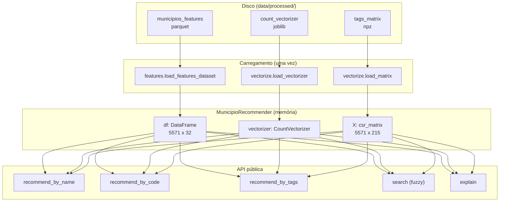

# Sessão 05 — Construindo o Recomendador Content-Based

> **Objetivo desta sessão.** Amarrar todas as peças anteriores em um sistema coeso e útil. Explicar como a classe `MunicipioRecommender` empacota dataset, vectorizer e matriz em uma API amigável; como as consultas por nome, código IBGE e tags customizadas são resolvidas; e como a função `explain` decompõe qualquer recomendação em fatores interpretáveis. Ao final, você vai entender como o sistema todo se comporta em casos reais como Cambuquira/MG e Uberlândia/MG.

## O que temos até aqui

Se você chegou até esta sessão lendo em ordem, tem todas as peças na mão. A Sessão 01 firmou o conceito de espaço vetorial e por que representar itens como vetores viabiliza comparação matemática. A Sessão 02 mostrou como transformar dados brutos do IBGE em uma string coesa por município — o campo `tags`. A Sessão 03 explicou como essa string vira vetor esparso via `CountVectorizer` com stemming português. A Sessão 04 cobriu as três métricas de comparação vetorial, com destaque para a similaridade cosseno.

O que ainda não fizemos: juntar tudo em uma interface humana. Ninguém quer, no dia a dia, carregar `dataset`, `vectorize` e `similarity` separadamente, encontrar o índice do município pelo nome, calcular a matriz de similaridade, ordenar top-k. Queremos escrever:

```python
rec = MunicipioRecommender.load()
resultados = rec.recommend_by_name("Cambuquira", uf="MG", k=5)
```

E receber uma lista tipada com os cinco municípios mais similares, prontos para exibir ou processar. Essa é a função do módulo `rec_agro_br.recommender` e da classe `MunicipioRecommender`.

## Analogia com o projeto DSA original

O projeto Cap08 da DSA implementa uma função solta:

```python
def recomendar_filmes(titulo, top_n=5):
    idx = df[df["title"] == titulo].index[0]
    scores = similarity[idx]
    top_indices = scores.argsort()[::-1][1:top_n+1]
    return df["title"].iloc[top_indices]
```

Simples e direto. Funciona para o escopo didático da matéria. Nossa versão preserva a mesma lógica no núcleo, mas amadurece a arquitetura em quatro direções: (i) encapsula o estado carregado — o dataset e a matriz têm custo de I/O que só faz sentido pagar uma vez; (ii) oferece múltiplos modos de consulta — por nome, código, tags — porque em uso real precisamos dessa flexibilidade; (iii) trata erros com exceções específicas e mensagens acionáveis, o que qualquer sistema além do "notebook de fim de aula" precisa fazer; (iv) adiciona uma função `explain` que responde a *"por que este município foi recomendado?"*, transformando o sistema de caixa-preta em caixa-branca.

## A arquitetura em três camadas



Três camadas com fronteiras claras. **Disco** guarda os artefatos serializados por fase anterior — regeneráveis a qualquer momento pelo pipeline. **Carregamento** é feito uma única vez, no `MunicipioRecommender.load()`. **Runtime** mantém tudo em memória para consultas rápidas. **API** expõe os cinco métodos de consulta ao mundo externo.

## Construção: `MunicipioRecommender.load()`

O método de classe `load` faz o carregamento canônico:

```python
@classmethod
def load(cls) -> "MunicipioRecommender":
    df = features.load_features_dataset()
    vec = vectorize.load_vectorizer()
    X = vectorize.load_matrix()
    return cls(df=df, vectorizer=vec, X=X)
```

Simples porque a complexidade foi empurrada para os módulos apropriados. Se algum artefato não existe em disco, cada `load_*` levanta `FileNotFoundError` com mensagem acionável ("rode primeiro X para gerar Y").

O construtor faz uma validação de sanidade — dataset e matriz precisam ter o mesmo número de linhas, e o dataset precisa ter as colunas essenciais:

```python
def _validar_consistencia(self):
    if len(self.df) != self.X.shape[0]:
        raise ValueError(
            f"Inconsistência: dataset tem {len(self.df)} linhas mas matriz "
            f"tem {self.X.shape[0]}. Refaça build-features e vectorize."
        )
    for col in ("id_municipio", "nome_municipio", "sigla_uf", "tags"):
        if col not in self.df.columns:
            raise ValueError(f"Coluna obrigatória ausente no dataset: {col}")
```

Essa validação existe porque é fácil, em uso interativo, esquecer de regenerar o vectorizer depois de modificar as features. O erro claro na construção evita horas de debug ao ver recomendações estranhas mais tarde.

## Consulta por nome: o caminho crítico

O método `recommend_by_name` é o mais usado e o que exercita todos os componentes. Vamos ler:

```python
def recommend_by_name(self, nome, uf=None, k=5, excluir_mesmo_uf=False):
    indice = self._locate_by_name(nome, uf=uf)
    return self._recommend_by_index(indice, k=k, excluir_mesmo_uf=excluir_mesmo_uf)
```

Duas responsabilidades separadas: resolução (nome → índice na tabela) e recomendação (índice → top-k). A resolução é onde acontece o tratamento de casos de erro:

```python
def _locate_by_name(self, nome, uf=None):
    nome_norm = nome.strip().casefold()
    mask = self.df["nome_municipio"].str.casefold() == nome_norm
    if uf is not None:
        mask &= self.df["sigla_uf"] == uf.upper()

    matches = self.df[mask]

    if len(matches) == 0:
        sugestoes = self.search(nome, max_results=5)
        msg = f"Nenhum município encontrado com nome '{nome}'"
        if uf:
            msg += f" na UF {uf.upper()}"
        if sugestoes:
            msg += f". Sugestões: {[f'{s[0]} ({s[1]})' for s in sugestoes]}"
        raise MunicipioNaoEncontradoError(msg)

    if len(matches) > 1:
        ufs = matches["sigla_uf"].unique().tolist()
        raise NomeAmbiguoError(
            f"Múltiplos municípios com nome '{nome}': "
            f"presente em {ufs}. Especifique a UF."
        )

    return int(matches.index[0])
```

Três caminhos: match único (bom, retorna o índice), match vazio (erro com sugestões via busca fuzzy) e múltiplos matches (erro pedindo desambiguação). Por que dois tipos de erro distintos (`MunicipioNaoEncontradoError`, `NomeAmbiguoError`) em vez de um `ValueError` genérico? Porque quem está consumindo essa API — o CLI, um notebook, um wrapper web — pode querer tratar cada caso diferente. Erro específico = tratamento específico possível.

A recomendação em si é curta:

```python
def _recommend_by_index(self, indice, k=5, excluir_mesmo_uf=False):
    query_vec = self.X[indice]                                    # 1 linha da matriz
    scores = similarity.cosine_similarity_matrix(query_vec, self.X)[0]

    excluir = [indice]                                            # o próprio índice
    if excluir_mesmo_uf:
        uf_query = self.df.iloc[indice]["sigla_uf"]
        excluir.extend(self.df.index[self.df["sigla_uf"] == uf_query].tolist())

    top = similarity.top_k_similares(scores, k=k, excluir_indices=excluir)
    return [self._make_result(idx, score) for idx, score in top]
```

Toda a "mágica" cabe em quatro linhas: pega o vetor da linha do município, calcula cosseno contra todos, monta lista de exclusão, chama `top_k`. O restante é conversão de índice + score em objeto tipado `RecomendacaoResult`.

## Consulta por tags customizadas

O método `recommend_by_tags` é o mais "criativo" — permite consultas que não correspondem a nenhum município real. Você monta uma string arbitrária de tokens e o sistema devolve os municípios mais próximos desse perfil hipotético.

```python
def recommend_by_tags(self, tags, k=5):
    query_series = pd.Series([tags])
    query_vec = vectorize.transform(self.vectorizer, query_series)

    if query_vec.nnz == 0:
        raise ValueError(
            "Nenhum token da query bate com o vocabulário do vectorizer. "
            "Verifique se as tags usam o mesmo formato do dataset."
        )

    scores = similarity.cosine_similarity_matrix(query_vec, self.X)[0]
    top = similarity.top_k_similares(scores, k=k)
    return [self._make_result(idx, score) for idx, score in top]
```

Note o uso de `vectorize.transform` (não `fit_transform`) — o vocabulário já está fixo, aplicamos ele à nova string sem refit. Um detalhe importante: se todos os tokens da query estiverem fora do vocabulário, `query_vec.nnz == 0` (nenhum non-zero) e a similaridade fica indefinida. O `raise` explícito evita retorno silencioso de lixo.

Exemplo de uso interessante: `rec.recommend_by_tags("sudeste alta_bovinocultura alta_avicultura", k=5)`. Isso pergunta *"quais municípios do Sudeste têm alta bovinocultura e alta avicultura?"*. O sistema devolve municípios cujas tags reais mais se aproximam desse perfil. Você viu no seu terminal que essa consulta retornou municípios de MG e SP com esse padrão, com similaridade $\approx 0{,}42$ — menor que uma consulta por município real porque a query tem apenas 3 tokens versus 17 dos municípios (mais tokens = mais possíveis coincidências).

## Search: quando o nome não está exato

Antes de o usuário conseguir chamar `recommend_by_name`, ele precisa saber o nome exato do município. Municípios brasileiros têm variações de grafia (Ubatuba vs Ubatuva? Uberlândia vs Uberlandia?), homônimos entre estados, acentos que confundem. O método `search` ajuda:

```python
def search(self, parcial, max_results=10):
    parcial_norm = parcial.strip().casefold()
    if not parcial_norm:
        return []

    nomes = self.df["nome_municipio"].astype(str)
    ufs = self.df["sigla_uf"].astype(str)

    # Etapa 1: substring case-insensitive
    contem = nomes.str.casefold().str.contains(parcial_norm, na=False)
    matches_substring = list(zip(nomes[contem], ufs[contem]))

    # Etapa 2: fuzzy (se sobrar espaço)
    resultados = matches_substring[:max_results]
    if len(resultados) < max_results:
        todos_nomes = nomes.unique().tolist()
        fuzzy_hits = difflib.get_close_matches(
            parcial, todos_nomes, n=max_results, cutoff=0.7
        )
        # ... adiciona sem duplicar
    return resultados[:max_results]
```

Duas etapas em cascata: primeiro substring, depois `difflib.get_close_matches` (fuzzy via distância de edição). O `cutoff=0.7` filtra matches muito distantes. Assim `search("Cambu")` retorna "Cambuquira", "Cambuci", "Cambaratiba", etc., e `search("Uberlandia")` (sem acento) ainda encontra "Uberlândia".

## Explain: caixa-preta vira caixa-branca

O método `explain` é a peça que diferencia o nosso projeto de um recomendador que apenas cospe uma lista sem justificativa. Recebe um par (query, recomendado) e devolve uma decomposição rica:

```python
@dataclass
class Explicacao:
    query_nome: str
    query_uf: str
    recomendado_nome: str
    recomendado_uf: str
    similaridade_cosseno: float
    distancia_euclidiana: float
    distancia_manhattan: float
    tokens_em_comum: list[str]
    tokens_so_query: list[str]
    tokens_so_recomendado: list[str]
```

A construção é direta:

```python
def explain(self, query_ref, recomendado_ref, query_uf=None, recomendado_uf=None):
    idx_q = self._resolver_ref(query_ref, query_uf)
    idx_r = self._resolver_ref(recomendado_ref, recomendado_uf)

    vec_q = self.X[idx_q]
    vec_r = self.X[idx_r]

    cos = similarity.cosine_similarity_pair(vec_q, vec_r)
    euc = similarity.euclidean_distance_pair(vec_q, vec_r)
    man = similarity.manhattan_distance_pair(vec_q, vec_r)

    tokens_q = set(self.df.iloc[idx_q]["tags"].split())
    tokens_r = set(self.df.iloc[idx_r]["tags"].split())
    em_comum = sorted(tokens_q & tokens_r)
    so_q = sorted(tokens_q - tokens_r)
    so_r = sorted(tokens_r - tokens_q)

    return Explicacao(...)
```

Interessante notar que aqui usamos as **implementações manuais** de `cosine_similarity_pair`, `euclidean_distance_pair` e `manhattan_distance_pair`, não as vetorizadas. Por dois motivos: primeiro, é uma comparação entre exatamente dois vetores, então não há ganho de vetorização; segundo, as três métricas em uma explicação didática merecem ser exercitadas na sua forma explícita — casa bem com o propósito de "caixa-branca".

## O caso Uberlândia/MG × Uberaba/MG

Quando você rodou `python -m rec_agro_br.recommender Uberlândia --uf MG --k 5 --explicar`, viu que Uberlândia teve como TOP-1 a cidade vizinha Uberaba (similaridade 0,95), e a explicação mostrou:

```
Similaridade cosseno:  0.9500
Distância euclidiana:  1.4142
Distância Manhattan:   2.0000
Tokens em comum (19):
  - alta_avicultura
  - alta_bovinocultura
  - alta_bubalinocultura
  ... [16 outros] ...
Tokens só em Uberlândia (1):
  - especializado_em_suinocultura
Tokens só em Uberaba (1):
  - especializado_em_avicultura
```

Vale a interpretação. Ambas as cidades têm perfil "alto" em *todas as oito atividades pecuárias*, o que é raro no Brasil e as coloca no topo do Triângulo Mineiro em intensidade agropecuária. Compartilham 19 dos 20 tokens de tag possíveis; diferem apenas na atividade classificada como dominante (a especialização é a que tem o maior percentil nacional entre as principais). Essa é uma diferença semanticamente pequena e o cosseno reflete isso: 0,95 (quase máximo).

Note também as três métricas simultâneas. Euclidiana = $\sqrt{1^2 + 1^2} = \sqrt{2} \approx 1{,}41$: diferem em duas dimensões binárias (as duas especializações), portanto vetores diferem por $(1, 1)$ nesse subespaço. Manhattan = $1 + 1 = 2$: número total de tokens em desacordo (o token que Uberlândia tem e Uberaba não tem, mais o token que Uberaba tem e Uberlândia não tem). Todas as três narrativas concordam sobre o quão próximas as duas cidades são.

## O sistema em produção

Uma vez que a classe existe e o CLI está configurado, o dia a dia de uso vira algo como:

```powershell
# Consulta rápida
.\tasks.ps1 recommend Cambuquira MG

# Análogos interestaduais (útil para benchmarking)
python -m rec_agro_br.recommender Cambuquira --uf MG --excluir-mesmo-uf --k 10

# Perfil hipotético (útil para estudo de mercado)
python -m rec_agro_br.recommender --tags "centro-oeste alta_bovinocultura" --k 5

# Explicação (útil para consultoria)
python -m rec_agro_br.recommender Sinop --uf MT --k 3 --explicar

# Busca fuzzy (quando você não sabe a grafia exata)
python -m rec_agro_br.recommender --search "Uber"
```

E no código Python, para integração com outros sistemas:

```python
from rec_agro_br.recommender import MunicipioRecommender

rec = MunicipioRecommender.load()

# Uso simples
for r in rec.recommend_by_name("Cambuquira", uf="MG", k=5):
    print(f"{r.similaridade:.4f} {r.nome}/{r.uf}")

# Uso analítico
exp = rec.explain("Uberlândia", "Uberaba", query_uf="MG", recomendado_uf="MG")
tokens_dominantes = exp.tokens_em_comum
```

Nada de esotérico. Fluxo linear, tipos claros, erros informativos.

## Recapitulando

O `MunicipioRecommender` costura dataset, vectorizer e matriz em uma classe de estado carregado uma vez e consultado muitas. Cinco métodos públicos cobrem os modos de consulta (por nome, código, tags, busca fuzzy) e a explicação. A resolução nome-para-índice tem tratamento cuidadoso de casos ambíguos e ausentes, com exceções específicas e sugestões acionáveis. O núcleo matemático delegado ao módulo `similarity` da Sessão 04 e a coordenação de dados vinda do módulo `features` da Sessão 02 se juntam aqui em uma API que faz sentido para uso interativo, notebook e integração programática. É o produto final do pipeline construído nas sessões anteriores.

## Próxima sessão

A Sessão 06 é opcional e apresenta o roteiro conceitual para a **extensão de nível mestrado** do projeto: validação espacial das recomendações via Moran's I. A pergunta que essa extensão responde é cientificamente interessante: *"municípios com perfil agropecuário similar tendem a ser geograficamente próximos, ou existem clusters agropecuários dispersos pelo território brasileiro?"* — pergunta que só faz sentido depois de termos um sistema de similaridade funcionando, como o que acabamos de construir.

## Referências

Aggarwal, C. C. *Recommender Systems: The Textbook*. Springer, 2016. Capítulo 4 (Content-Based Recommender Systems) é a referência canônica para o tipo de sistema que construímos, com discussões formais sobre representação de itens e função de similaridade.

Ricci, F.; Rokach, L.; Shapira, B. *Recommender Systems Handbook*. Springer, 3ª ed., 2022. Capítulo 4 (Content-based Recommender Systems: State of the Art and Trends) situa o content-based no mapa mais amplo dos sistemas de recomendação (colaborativos, híbridos, baseados em conhecimento).

Fowler, M. *Refactoring: Improving the Design of Existing Code*. Addison-Wesley, 2ª ed., 2018. Nossa refatoração da função solta `recomendar_filmes` do projeto DSA para a classe `MunicipioRecommender` segue padrões clássicos deste livro (extract class, replace magic literal with symbolic constant, introduce parameter object).

scikit-learn Documentation. *Model persistence*. [scikit-learn.org/stable/model_persistence.html](https://scikit-learn.org/stable/model_persistence.html). Discute o uso de joblib para serialização de modelos e as armadilhas conhecidas com funções customizadas — o bug de pickle que enfrentamos e corrigimos está documentado lá.
