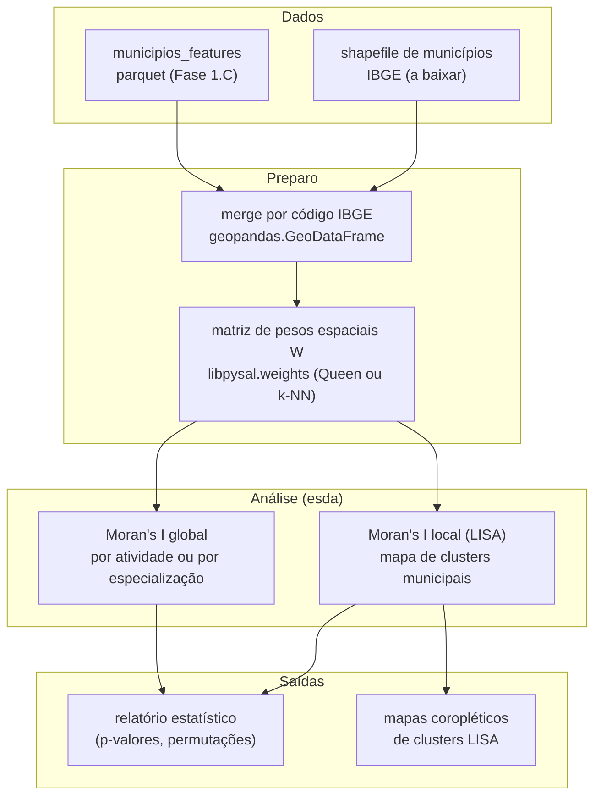

# Sessão 06 — Extensão de Mestrado: Validação Espacial com Moran's I

> **Objetivo desta sessão.** Apresentar o roteiro conceitual para a extensão de nível mestrado do projeto — validar cientificamente se as similaridades produzidas pelo recomendador têm significado espacial. A pergunta central é: *"municípios com perfil agropecuário similar tendem a ser geograficamente próximos, ou existem clusters agropecuários dispersos pelo território brasileiro?"* Esta sessão é um roadmap, não uma implementação completa — a Fase 1.G do projeto (opcional) tratará da execução.

## Por que essa sessão existe

O projeto Cap08 da pós-DSA fecha o escopo no recomendador. É suficiente para a disciplina e para um portfólio inicial. Mas o Pedro Luiz, autor deste repositório, tem formação em **Engenharia Florestal** e trabalha profissionalmente com **ciência de dados geoespacial** no EnvironBIT e no Vimef Engenharia. Para esse perfil de portfólio, a extensão natural do projeto é conectar o sistema de recomendação a uma pergunta científica de análise espacial. É isso que a Fase 1.G proporciona.

A pergunta é rica porque tem resposta empírica não-óbvia. Se a resposta fosse "obviamente sim, municípios próximos são parecidos", o valor científico seria baixo — estaríamos apenas confirmando a intuição de que Cambuquira/MG deve ser parecida com outras cidades do Sul de Minas. Se fosse "obviamente não, o Brasil é heterogêneo em micro-escala", também. Mas a resposta real é *quantitativa*: qual a *intensidade* da autocorrelação espacial? Existe autocorrelação positiva forte (clusters regionais), fraca (perfis aleatoriamente distribuídos), ou negativa (municípios similares evitam vizinhança)? Isso só se sabe medindo.

## O que é autocorrelação espacial

**Autocorrelação espacial** é a extensão para o espaço geográfico do conceito clássico de autocorrelação temporal. Séries temporais autocorrelacionadas positivamente têm valores adjacentes no tempo tendendo a se parecer (temperatura de hoje é parecida com a de ontem); dados espaciais autocorrelacionados positivamente têm regiões adjacentes no espaço tendendo a se parecer.

Formalmente, a autocorrelação espacial mede a correlação entre o valor de uma variável em uma localização e o valor da mesma variável em suas localizações vizinhas. Para dados municipais no Brasil, "vizinhas" pode significar contíguas (tocam a mesma fronteira) ou próximas (dentro de um raio geográfico).

## Moran's I: a métrica canônica

O índice de Moran (Moran's I) é a métrica clássica para autocorrelação espacial global. Foi proposto por P.A.P. Moran em 1950 e continua sendo o padrão em análise espacial estatística. Sua fórmula:

$$I = \frac{n}{\sum_{i=1}^n \sum_{j=1}^n w_{ij}} \cdot \frac{\sum_{i=1}^n \sum_{j=1}^n w_{ij}(x_i - \bar{x})(x_j - \bar{x})}{\sum_{i=1}^n (x_i - \bar{x})^2}$$

Parece assustador; não é. Os componentes:

- $n$ é o número de unidades espaciais (5571 municípios brasileiros).
- $x_i$ é o valor da variável de interesse na unidade $i$.
- $\bar{x}$ é a média nacional da variável.
- $w_{ij}$ é o peso espacial que expressa quão "vizinhas" as unidades $i$ e $j$ são (1 se contíguas, 0 caso contrário; ou algo mais suave).

O numerador conta as covariâncias ponderadas pela vizinhança. O denominador normaliza pela variância total. O resultado $I$ tipicamente está em $[-1, 1]$, mas pode extravasar em casos extremos.

Interpretação:

- $I \approx 1$: forte autocorrelação positiva. Vizinhos são muito parecidos. Existem clusters regionais bem definidos.
- $I \approx 0$: sem autocorrelação. A distribuição espacial parece aleatória.
- $I \approx -1$: forte autocorrelação negativa. Vizinhos são muito diferentes. Padrão de "tabuleiro de xadrez".

Sob a hipótese nula de distribuição aleatória, o valor esperado é $E(I) = -1/(n-1)$ — quase zero para $n$ grande. A significância estatística vem de comparar o $I$ observado com essa distribuição de referência.

## Como isso se conecta ao nosso projeto

Cada município do dataset tem um vetor $\mathbf{u}_i \in \mathbb{R}^{215}$ produzido pelo pipeline. A matriz de similaridade $S \in \mathbb{R}^{5571 \times 5571}$ onde $s_{ij} = \cos(\mathbf{u}_i, \mathbf{u}_j)$ é exatamente o que o `recommender` calcula sob demanda.

Podemos aplicar Moran's I à matriz de similaridade $S$ perguntando: *a similaridade agropecuária tem estrutura espacial?* Especificamente, para cada município $i$, calculamos a média das similaridades entre $i$ e seus vizinhos geográficos, e comparamos com a média global de similaridades — Moran's I quantifica se esses dois números divergem sistematicamente.

Alternativamente, podemos aplicar Moran's I a cada dimensão do vetor separadamente. Por exemplo, o token "alta_bovinocultura" tem valor 1 nos municípios com essa característica e 0 nos outros. Moran's I dessa variável responde: *municípios com alta bovinocultura tendem a estar próximos uns dos outros ou dispersos?*

## Diagrama do fluxo proposto



## As bibliotecas necessárias

O ecossistema Python de análise espacial se organiza em torno do PySAL (*Python Spatial Analysis Library*). Três bibliotecas dele são fundamentais para esta extensão:

**geopandas** faz o join espacial entre nosso dataset processado e o shapefile de contornos municipais do IBGE. Uma vez feito, o `GeoDataFrame` resultante tem uma coluna `geometry` com o polígono de cada município — base para tudo mais.

**libpysal.weights** constrói a matriz de pesos espaciais $W$. Duas escolhas naturais para municípios brasileiros: **Queen contiguity** ($w_{ij}=1$ se $i$ e $j$ compartilham qualquer ponto de fronteira, análogo ao movimento da rainha no xadrez) e **k-nearest neighbors** ($w_{ij}=1$ se $j$ é um dos $k$ municípios mais próximos de $i$ por centroide). Queen é mais natural para dados administrativos; k-NN é mais robusto a variações no tamanho dos municípios (relevante no Brasil, onde municípios da Amazônia são gigantes e do Sudeste são pequenos).

**esda** (*Exploratory Spatial Data Analysis*) implementa o Moran's I global (`esda.Moran`) e o Moran's I local ou LISA (`esda.Moran_Local`). O primeiro dá um número resumo para o país inteiro; o segundo mapeia por município se aquele município específico está em cluster de alta similaridade (HH), baixa similaridade (LL), ou zona de transição (HL, LH).

## Um esboço de código

O roteiro completo caberá em um script separado (`scripts/analise_espacial.py` ou notebook), mas o esqueleto pode ser antecipado aqui em forma didática. Não é para rodar ainda — é para dar ideia da forma.

```python
import geopandas as gpd
import libpysal
import esda
import numpy as np

# 1) Carrega dataset processado e shapefile IBGE
df_features = pd.read_parquet("data/processed/municipios_features.parquet")
gdf_municipios = gpd.read_file("data/external/br_municipios_2024.shp")
gdf = gdf_municipios.merge(
    df_features, left_on="CD_MUN", right_on="id_municipio"
)

# 2) Constrói matriz de pesos Queen contiguity
w = libpysal.weights.Queen.from_dataframe(gdf)
w.transform = "r"   # normalização por linha (padrão para Moran)

# 3) Moran's I global sobre uma variável de interesse.
#    Exemplo: intensidade de avicultura (0/1 por município).
variavel = (gdf["perfil_avicultura"] == "alta_avicultura").astype(int).values
moran = esda.Moran(variavel, w, permutations=999)
print(f"Moran's I = {moran.I:.4f}")
print(f"E(I) sob H_0 = {moran.EI:.4f}")
print(f"p-value (permutação) = {moran.p_sim:.4f}")

# 4) Moran's I local (LISA) para mapear clusters
moran_local = esda.Moran_Local(variavel, w, permutations=999)
gdf["cluster_type"] = moran_local.q                 # 1=HH, 2=LH, 3=LL, 4=HL
gdf["cluster_sig"] = moran_local.p_sim < 0.05       # significativo?

# 5) Mapa coroplético
fig, ax = plt.subplots(figsize=(12, 10))
gdf.plot(
    column="cluster_type", categorical=True,
    legend=True, ax=ax,
    cmap="Set1",
)
```

## Hipóteses testáveis

Antes de rodar a análise, vale explicitar as hipóteses substantivas que ela pode confirmar ou refutar. Isso é ciência: não fazer análise "para ver o que dá", mas ter perguntas específicas e ver o que os dados dizem sobre elas.

**Hipótese 1**: municípios com "especializado_em_avicultura" estão espacialmente agregados no Sul de Minas e no Norte-Noroeste de SP (formando um cluster HH significativo), e no Sul do país (Rio Grande do Sul e Santa Catarina). Se verdade, Moran's I global positivo e $p < 0{,}05$, com clusters LISA identificáveis nessas regiões.

**Hipótese 2**: municípios com "especializado_em_bovinocultura" estão espacialmente agregados no Centro-Oeste (Mato Grosso, Mato Grosso do Sul, Goiás), no Triângulo Mineiro e no Norte do país (Pará, Rondônia). Moran's I esperado é positivo e alto.

**Hipótese 3**: municípios rotulados como "sem_producao_pecuaria" estão espacialmente agregados nas regiões metropolitanas (São Paulo, Rio de Janeiro, Belo Horizonte, Distrito Federal). Cluster HH esperado nas metrópoles; LISA identifica.

**Hipótese 4** (mais interessante): o *ranking* das top-5 recomendações do sistema tem correlação espacial. Ou seja, se pegarmos para cada município a média da similaridade cosseno com seus vizinhos geográficos, essa média será significativamente maior que a média global. Essa é a hipótese que valida cientificamente o recomendador: se ela se sustentar, temos evidência empírica de que "similaridade agropecuária" tem interpretação espacial coerente, e o sistema não está apenas encontrando ruído estatístico.

## Cuidados metodológicos

Uma análise espacial rigorosa exige atenção a alguns pontos.

**Escolha da matriz de pesos**. Queen vs Rook vs k-NN vs distância inversa. Municípios amazônicos gigantes têm poucos vizinhos por Queen mas muitos por k-NN. A escolha muda os resultados. Boa prática: reportar Moran's I sob duas ou três especificações de $W$ e verificar robustez.

**Modifiable Areal Unit Problem (MAUP)**. Municípios são uma unidade administrativa arbitrária; resultados de análise espacial dependem dessa unidade. Um estudo defensivo replicaria os cálculos em outra escala (mesorregiões, por exemplo) para verificar se as conclusões qualitativas se mantêm.

**Correção para múltiplos testes**. Moran's I local (LISA) faz um teste por município — 5571 testes simultâneos. Sob $p = 0{,}05$ ingênuo, esperaríamos $\sim 279$ falsos positivos. Correções comuns: Bonferroni (conservadora), FDR de Benjamini-Hochberg (mais moderna). O pacote `esda` oferece isso.

**Permutação vs teoria assintótica**. Podemos calcular $p$-valor pela distribuição normal assintótica de $I$, mas para $n$ moderado (nossos 5571) e com dependência espacial forte, o método de permutação (embaralhar aleatoriamente os valores no mapa, recalcular $I$ 999 vezes) é mais confiável e computacionalmente barato hoje em dia. Nosso esboço usa `permutations=999`.

## Uma limitação técnica prática

O ecossistema PySAL exige dependências pesadas para funcionar no Windows — GDAL, PROJ, GEOS, Fiona. A instalação via `pip` geralmente é problemática; o caminho recomendado é usar `conda` e o canal `conda-forge`. Por isso a Fase 1.G ficou marcada como opcional: entrega apenas quando o Pedro se dispuser a lidar com o overhead de setup. Uma alternativa mais leve, se a análise for feita em uma máquina Linux ou macOS, é usar `mamba` ou `pixi` — instaladores rápidos que resolvem essas dependências em segundos.

## Um roteiro concreto para a Fase 1.G

Quando a Fase 1.G for executada, o entregável natural será:

1. Um novo módulo `rec_agro_br.spatial` com funções `load_shapefile_ibge()`, `build_weights_matrix(gdf, method="queen")`, `moran_global(gdf, variavel, w)`, `moran_local(gdf, variavel, w)`.
2. Um script `scripts/analise_espacial.py` que orquestra o pipeline (dataset processado + shapefile → matriz W → Moran's I global e local → relatório de p-valores e mapas).
3. Um segundo notebook `notebooks/02_analise_espacial.ipynb` que apresenta o resultado no formato didático estabelecido pela Sessão 05.
4. Testes em `tests/test_spatial.py` que exercitam as funções com um mini-dataset sintético (10 municípios sintéticos com contiguidades fictícias, valores conhecidos, Moran's I esperado calculado à mão).
5. Uma atualização desta Sessão 06 substituindo o roadmap por narrativa de resultados reais.

Estimativa de esforço para essa fase: 1 a 2 semanas de trabalho part-time, considerando o overhead do setup de dependências geoespaciais. Alto valor científico e alta discutibilidade em entrevistas de emprego para o perfil geo/agro do Pedro.

## Recapitulando

A Sessão 06 encerra a apostila apontando para além do escopo do projeto DSA original. O sistema de recomendação da Sessão 05 produz similaridades entre municípios; essas similaridades podem ser cientificamente validadas via Moran's I aplicado à sua distribuição espacial. A pergunta *"municípios similares tendem a estar próximos?"* não tem resposta a priori — precisa ser medida. As bibliotecas PySAL, geopandas e esda oferecem o ferramental completo. A Fase 1.G do projeto (opcional, nível mestrado) executará esse plano quando o autor tiver disponibilidade e as dependências geoespaciais forem viáveis no ambiente de trabalho.

## Referências

Anselin, L. *Local Indicators of Spatial Association — LISA*. Geographical Analysis, 27(2), 1995. O paper seminal sobre Moran's I local. Leitura essencial para entender a interpretação HH/LL/HL/LH dos clusters.

Rey, S. J.; Anselin, L. *PySAL: A Python Library of Spatial Analytical Methods*. Review of Regional Studies, 37(1), 2007. Introdução ao ecossistema PySAL pelos autores originais. A biblioteca evoluiu bastante desde então, mas a filosofia continua a mesma.

Câmara, G.; Carvalho, M. S.; Cruz, O. G.; Correa, V. *Análise Espacial de Dados Geográficos*. INPE, 2004. Referência em português para análise espacial, escrita pelo grupo do INPE. Cobre Moran's I, matrizes de pesos e LISA com aplicações a dados brasileiros.

Moran, P. A. P. *Notes on Continuous Stochastic Phenomena*. Biometrika, 37(1/2), 1950. O paper original que introduziu o índice. Curto (5 páginas), técnico, mas historicamente importante.

Documentação PySAL. [pysal.org](https://pysal.org/). Ponto de entrada para os subpacotes `libpysal`, `esda`, `spopt`, `spglm`. Excelentes notebooks de exemplo em [pysal.org/notebooks](https://pysal.org/notebooks).
